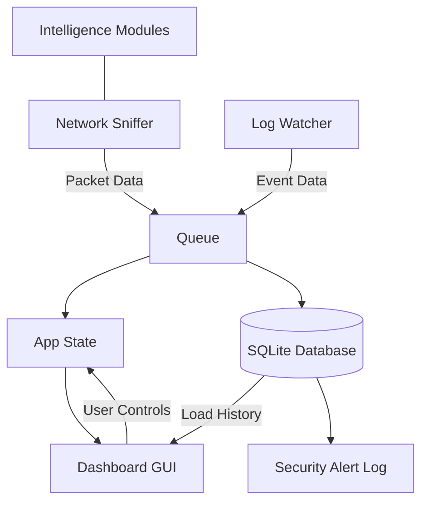

# SentinelHIDS

**Local Host Intrusion & Privacy Monitoring System (Windows)**

SentinelHIDS is a lightweight, host-based intrusion detection system designed for Windows. It monitors network traffic and system events in real-time to detect suspicious activity and potential privacy leaks.

## Features

- **Operational Intelligence**: Real-time stats dashboard showing packet counts, filtered noise, and security alerts.
- **Session Persistence**: Stores all alerts in a local SQLite database, allowing for historical review upon application restart.
- **Monitoring Controls**: One-click "Start/Pause" monitoring with clear visual status indicators.
- **Network Monitoring & Enrichment**:
  - **Process Mapping**: Correlates outbound traffic to specific Windows executables (e.g., `chrome.exe`).
  - **GeoIP Integration**: Resolves destination IPs to country codes using MaxMind.
  - **Unencrypted Traffic Detection**: Flags Port 80 (HTTP) connections as security warnings.
- **Security Audit Logging**: High-severity alerts are automatically exported to a dedicated `security_alerts.log` file.
- **Log Intelligence**:
  - **Temporal Aggregation**: Deduplicates repetitive high-frequency flows with a hit counter.
  - **Semantic Noise Suppression**: Automatically filters background noise (mDNS, SSDP, LLMNR).
- **System Event Monitoring**: Watches Windows Security Logs for potential system-level threats.
- **Local-First Privacy**: Operates entirely offline; no data ever leaves the host.

## Architecture



## Tech Stack

- **Language**: Python 3.11+
- **GUI**: CustomTkinter
- **Database**: SQLite3
- **Network Capture**: PyShark (TShark engine)
- **Intelligence**: psutil (Process mapping), geoip2 (GeoIP)
- **System Logs**: pywin32
- **Config**: YAML

## Prerequisites

SentinelHIDS requires specific Windows drivers and tools to function:

1.  **Npcap**: Install from [nmap.org/npcap](https://nmap.org/npcap/). During installation, check the box **"Install Npcap in WinPcap API-compatible Mode"**.
2.  **Wireshark / TShark**: Install from [wireshark.org](https://www.wireshark.org/). TShark is used as the underlying capture engine.
3.  **GeoIP Database**: Place `GeoLite2-City.mmdb` in the `data/` directory for GeoIP features.
4.  **Administrator Privileges**: The application must be run from an Elevated/Admin terminal to access network drivers and Security Event Logs.

## Installation

1.  **Clone the repository**:
    ```bash
    git clone https://github.com/yourusername/SentinelHIDS.git
    cd SentinelHIDS
    ```

2.  **Install Python dependencies**:
    ```bash
    python -m pip install -r requirements.txt
    ```

## Usage

1.  Open **Command Prompt** or **PowerShell** as **Administrator**.
2.  Navigate to the project directory.
3.  Run the application:
    ```bash
    python main.py
    ```

## Project Structure

```text
SentinelHIDS/
├── main.py                 # Application launcher & thread manager
├── core/
│   ├── sniffer.py          # Network capture & intelligence integration
│   ├── log_watcher.py      # Event log monitoring
│   ├── database.py         # SQLite persistence & event logging
│   ├── process_mapper.py   # PID to Executable resolution
│   ├── geoip_manager.py    # Offline GeoIP lookups
│   ├── state.py            # Shared application state
│   └── models.py           # Structured alert dataclasses
├── ui/
│   └── dashboard.py        # Multi-view CustomTkinter dashboard
├── data/
│   ├── alerts.db           # Persistent SQLite database
│   ├── security_alerts.log # Exported security audit trail
│   ├── rules.yaml          # Detection logic thresholds
│   └── GeoLite2-City.mmdb  # MaxMind Database (Required)
├── docs/
│   └── PLANNING.md         # Detailed project roadmap
└── requirements.txt
```

## Troubleshooting

- **TShark not found**: Ensure Wireshark is installed and `tshark.exe` is in your system PATH.
- **Permission Denied**: Ensure you are running the terminal as Administrator.
- **Sniffer Crash**: Verify Npcap is installed and your network interface is active.

## License

Designed for defensive monitoring, auditing, and educational purposes.
